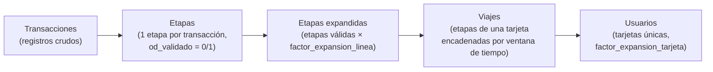

# Documentación del Dashboard de UrbanTrips

Este documento describe cada página del dashboard de Streamlit (`urbantrips/dashboard/`), qué muestra y —para las páginas de mayor complejidad conceptual— cómo se calculan sus indicadores. El dashboard se compone del script principal `dashboard.py` (pantalla de inicio) y de las páginas numeradas en `urbantrips/dashboard/pages/`, que aparecen en ese mismo orden en la barra lateral de Streamlit.

Todas las magnitudes "expandidas" que se mencionan a lo largo de este documento están ponderadas por alguno de los factores de expansión que UrbanTrips calcula durante el procesamiento (ver [Factores de expansión](source/factores_expansion.rst)):

- **`factor_expansion_original`**: el factor que trae el archivo de transacciones de origen (1 si no hay muestreo).
- **`factor_expansion_tarjeta`**: expande al total de tarjetas (usuarios) del archivo original, redistribuyendo el peso de las tarjetas sin OD válido hacia las que sí lo tienen.
- **`factor_expansion_linea`**: expande etapas/viajes al total de transacciones reportadas por línea, calibrando `factor_expansion_tarjeta` contra la cantidad de transacciones de cada línea antes de la depuración de datos.

---

## 1. Datos Generales

Esta es la primera página del dashboard (`1_Datos Generales.py`), precedida por la pantalla de inicio (`dashboard.py`) que se muestra al abrir la aplicación. Ambas comparten el mismo propósito: dar una foto agregada de todo el sistema para un día seleccionado, antes de entrar al detalle por línea o por zona. Por eso se documentan juntas en este primer ítem.

### 1.1 Resumen general (pantalla de inicio): transacciones, etapas, etapas expandidas, viajes y usuarios

La pantalla de inicio (`urbantrips/dashboard/dashboard.py`) lee la tabla `indicadores` (poblada por `urbantrips/datamodel/misc.py::persist_indicators` y por `urbantrips/destinations/destinations.py`) y arma un "embudo" que va desde el dato crudo de entrada hasta los viajes y usuarios finales. Los conceptos, en el orden en que se consumen unos a otros, son:

**Transacciones** (tabla `transacciones`, tabla de indicadores `"transacciones"`)
- Es el insumo crudo: cada fila es un evento de pago/validación de tarjeta en un vehículo (registro georreferenciado con `id_tarjeta`, `id_linea`, fecha/hora y, opcionalmente, un `factor_expansion` si los datos son una muestra).
- El dashboard muestra dos valores: **"Registros en transacciones"** (`COUNT(*)`, cantidad de filas crudas) y **"Cantidad de transacciones totales"** (`SUM(factor_expansion)`, es decir las transacciones ya expandidas por el factor de muestreo original, antes de cualquier validación).
- Cálculo: [urbantrips/datamodel/misc.py](../urbantrips/datamodel/misc.py#L149-L166) (`persist_indicators`, bloque `TRANSACCIONES`).

**Etapas** (tabla `etapas`)
- Cada transacción se convierte en una etapa: un tramo de viaje en una única línea/modo. La etapa hereda los datos de la transacción y le suma un `id_viaje`/`id_etapa` (ver más abajo, "Viajes") y el hexágono H3 de origen (`h3_o`). Este pasaje 1 a 1 transacción → etapa ocurre en `build_legs_dataframe` ([urbantrips/datamodel/legs.py](../urbantrips/datamodel/legs.py#L82-L131)).
- Luego, en la etapa de imputación de destinos ([urbantrips/destinations/destinations.py](../urbantrips/destinations/destinations.py)) se le imputa el destino (`h3_d`) y se marca `od_validado = 1` cuando la etapa tiene coordenadas válidas (no `lat/lon = 0`) y una distancia origen-destino ruteable (`distance_od` no nula ni cero). El indicador **"Cantidad de etapas con destinos validados"** (tabla `"etapas"` en el dashboard) es el conteo simple (sin ponderar) de etapas con `od_validado = 1`.
  Cálculo: [urbantrips/destinations/destinations.py](../urbantrips/destinations/destinations.py#L312-L322) (`calcular_indicadores_destinos_etapas`).

**Etapas expandidas** (tabla de indicadores `"etapas_expandidas"`)
- Es la cantidad de etapas válidas (`od_validado = 1`) **ponderada por `factor_expansion_linea`**, es decir, llevada al total de transacciones que efectivamente reportó cada línea (no solo las etapas que sobrevivieron a la validación de datos).
- Fórmula: $\text{Etapas expandidas} = \displaystyle\sum \text{factor de expansión por línea}$, sumado sobre las etapas con `od_validado = 1`.
- También se desagrega por modo ("Etapas bus", "Etapas tren", etc.), con la misma suma pero agrupada por `modo`.
- Cálculo: [urbantrips/datamodel/misc.py](../urbantrips/datamodel/misc.py#L167-L195).
- `factor_expansion_linea` se calcula en tres pasos dentro de `_create_trips_day_loop` ([urbantrips/datamodel/trips.py](../urbantrips/datamodel/trips.py#L135-L300)):
  1. **Factor por tarjeta**: redistribuye el peso (`factor_expansion_original`) de las tarjetas sin viaje OD válido hacia las tarjetas que sí lo tienen, preservando el total de tarjetas por día.
  2. **Factor por línea**: para cada línea, calcula la razón entre el peso total de transacciones de esa línea y el peso de las que quedaron válidas, y la calibra además contra la cantidad de transacciones reportada por la línea en el archivo original (tabla `transacciones_linea`).
  3. El resultado final es `factor_expansion_original × ratio_línea × od_validado` — o sea, 0 para las etapas no válidas y un valor calibrado para las válidas.

**Viajes** (tabla `viajes`)
- Un viaje es una cadena de una o más etapas de la misma tarjeta (`id_tarjeta`) que se agrupan en una única "salida" del usuario. El encadenamiento depende del parámetro `ordenamiento_transacciones` de la configuración:
  - **`fecha_completa`** (con timestamps reales): todas las etapas dentro de una ventana de `ventana_viajes` minutos (configurable, valor típico 120 min) desde el **primer tap** del viaje pertenecen al mismo `id_viaje`. Implementado de forma vectorizada en [urbantrips/datamodel/legs.py](../urbantrips/datamodel/legs.py#L468-L565) (`asignar_id_viaje_etapa_fecha_completa` / `_trip_ids_from_deltas`).
  - **`orden_trx`** (sin timestamps confiables): se usa el orden secuencial de las transacciones de la tarjeta ([urbantrips/datamodel/legs.py](../urbantrips/datamodel/legs.py#L512-L544)).
- Igual que con las etapas, se distingue:
  - **"Cantidad de registros en viajes"** (tabla `"viajes"`): `COUNT(*)` de viajes con `od_validado = 1` (viajes crudos, sin ponderar).
  - **"Cantidad total de viajes expandidos"** (tabla `"viajes expandidos"`): $\sum \text{factor de expansión por línea}$ de esos mismos viajes, además de sub-indicadores como "viajes con transferencia" (`cant_etapas > 1`) y "viajes cortos (<5kms)".
  - Cálculo: [urbantrips/datamodel/misc.py](../urbantrips/datamodel/misc.py#L227-L290).

**Usuarios** (tarjetas, `id_tarjeta`)
- Un usuario es una tarjeta única. Como una misma tarjeta puede aparecer varias veces en el día (varios viajes), no alcanza con contar filas: se toma **un solo valor de factor de expansión por tarjeta y por día** y se suman esos valores.
  - **"Cantidad de tarjetas finales"** (tabla `"usuarios"`): para cada tarjeta y día se toma el máximo `factor_expansion_tarjeta` (constante por tarjeta) y se suma. Refleja la cantidad total de usuarios reales del sistema ese día.
  - **"Cantidad total de tarjetas"** (tabla `"usuarios expandidos"`): igual, pero usando el mínimo `factor_expansion_linea` de la tarjeta.
  - Cálculo: [urbantrips/datamodel/misc.py](../urbantrips/datamodel/misc.py#L196-L226).
- Regla general del proyecto: para analizar **etapas o viajes** conviene usar `factor_expansion_linea`; para analizar **usuarios/tarjetas** conviene usar `factor_expansion_tarjeta` (ver [docs/source/factores_expansion.rst](source/factores_expansion.rst)).

En resumen, el "embudo" que se ve en la pantalla de inicio va de más bruto a más elaborado:



### 1.2 Contenido propio de la página "Datos Generales"

Además del resumen anterior (que en rigor vive en la pantalla de inicio), la página `1_Datos Generales.py` agrega, para el día y género seleccionados:

- **Partición modal** (`datos_particion_modal`): diagrama de Venn/treemap de combinaciones de modos usados (multimodalidad y multietapa) y tablas de cantidad/porcentaje de etapas y viajes por modo.
- **Distancias de viaje** (`distribucion`): histograma de la distribución de distancias de los viajes.
- **Viajes por hora** (`viajes_hora`): evolución horaria de la cantidad de viajes, total y por modo.
- **Indicadores socio-demográficos** (`socio_indicadores`): totales, porcentajes y promedios ponderados de viajes/etapas por género (`genero_agregado`) y tipo de tarifa (`tarifa_agregada`), y tiempos promedio entre viajes.

---

## 2. Líneas de Deseo

Página `2_Líneas de Deseo.py`. Muestra las líneas de deseo (matriz origen-destino agregada por zona) sobre un mapa interactivo, a partir de las tablas `chains_norm`, `etapas`, `viajes`, `socio_indicadores` y las zonificaciones cargadas. Permite filtrar por día, zonificación, presencia/ausencia de transferencias, modos de transporte, rango horario, distancia y atributos socio-demográficos (género, tarifa), y ofrece tanto la visualización de arcos entre zonas como tablas detalladas de la matriz origen-destino.

## 3. Polígonos

Página `3_Poligonos.py`. Es una variante de "Líneas de Deseo" acotada a un polígono de análisis definido previamente (tabla `poligonos`). Permite elegir el polígono y la zonificación, aplica los mismos filtros (día, transferencias, modos, rango horario, distancia) y muestra indicadores demográficos cruzados y matrices OD, además de las líneas de deseo que tocan el polígono (como origen, destino, o ambos).

## 4. Herramientas interactivas

Página `4_Herramientas interactivas.py`. Permite disparar, desde el propio dashboard, el cálculo de indicadores para una línea puntual: se elige línea, tipo de día (hábil/fin de semana), período (mes/año) y parámetros geométricos (cantidad de secciones o metros por sección, rango horario), y se ejecutan en cadena los cálculos de indicadores básicos de KPI, matriz OD, oferta por segmento y carga por tramo. Los resultados quedan disponibles luego en la página "Indicadores de oferta y demanda" y se exportan como CSV a `resultados/`.

## 5. Indicadores de oferta y demanda

Página `5_Indicadores de oferta y demanda.py`. Muestra, para una línea, tipo de día y período elegidos, el factor de ocupación por hora, la demanda por tramo del recorrido, las líneas de deseo propias de esa línea, la matriz OD y la oferta por segmento, a partir de las tablas `basic_kpi_by_line_hr`, `ocupacion_por_linea_tramo`, `matrices_linea` y `supply_stats_by_section_id` generadas por la página anterior ("Herramientas interactivas") o por el pipeline de KPI en base a datos de GPS/servicios.

## 6. Comparación de líneas

Página `6_Comparación de líneas.py`. Compara la cobertura y la demanda de dos líneas (o dos ramales) seleccionadas, calculando la superposición de sus recorridos en celdas H3 (con resolución configurable mediante un slider) y la superposición de su demanda (etapas). Muestra mapas interactivos con la cobertura de cada línea y el área de solapamiento, junto con estadísticas resumen y un exportador de los datos de demanda.

## 7. Análisis de zonas

Página `7_Análisis de zonas.py`. Ofrece un mapa con herramientas de dibujo (polígonos/rectángulos) para definir dos zonas ad-hoc, que se convierten internamente en conjuntos de celdas H3. A partir de `chains_norm` calcula y muestra etapas y viajes por modo/línea dentro de cada zona, así como los viajes (y transferencias) que conectan una zona con la otra.

## 8. Estimar demanda

Página `8_Estimar_demanda.py`. Permite dibujar una zona o un buffer alrededor de un recorrido y estimar la demanda de etapas de una línea dentro de esa área, para un tipo de día, período y rango horario dados. Calcula una matriz OD restringida a la zona dibujada, detectando automáticamente la resolución H3 de los datos disponibles, y presenta el resultado como tabla y mapa.

## 9. Indicadores Operativos

Página `9_Indicadores Operativos.py`. Es la página que concentra los KPI operativos por línea, calculados por el módulo `urbantrips/kpi/` y almacenados en la tabla `kpis_lineas`. Tiene tres bloques: **KPIs por línea** (filtrando por línea y día, o por "Promedios"), **Totales y promedios del sistema** (filtrando por modo) y una **base completa descargable en CSV**.

### 9.1 Indicadores generales y demográficos

- **Vehículos operativos**: cantidad de internos (`interno`) distintos con al menos un servicio válido (`services.valid = 1`) ese día para la línea. Cálculo: [urbantrips/kpi/kpi_lineas.py](../urbantrips/kpi/kpi_lineas.py#L309-L324).
- **Transacciones**: pasajeros totales ponderados, $\sum \text{factor de expansión por línea}$ de las etapas de esa línea/día (equivalente a "etapas expandidas" pero a nivel de línea). Cálculo: [urbantrips/kpi/kpi_lineas.py](../urbantrips/kpi/kpi_lineas.py#L186-L215).
- **Género y tipo de tarifa**: desagregación de esas mismas transacciones por `genero_agregado` (Masculino/Femenino/No informado) y `tarifa_agregada` (sin descuento/tarifa social/estudiantes-jubilados), mostrada en valor absoluto y como porcentaje del total de transacciones de la línea.

### 9.2 Indicadores operativos: definiciones y fórmulas

Antes de las fórmulas, tres variantes de distancia que reaparecen en todos los indicadores (ver comentarios en [urbantrips/kpi/kpi_lineas.py](../urbantrips/kpi/kpi_lineas.py#L27-L58)):

| Sufijo | Significado |
|---|---|
| `_od` | Distancia entre el origen y el destino de la etapa/viaje, estimada con la matriz de ruteo (no depende de tener GPS del vehículo). |
| `_route` | Distancia reconstruida "ping a ping" a partir de las coordenadas GPS reales del vehículo. |
| `_route_gps` | Distancia de odómetro reportada por el propio dispositivo/validador del vehículo (`distance_servicio_mts`). |

**IPK — Índice de Pasajeros por Kilómetro**

$$\text{IPK} = \frac{\text{pasajeros}}{\text{km recorridos}}$$

Donde "pasajeros" (columna `tot_pax`) es la cantidad de pasajeros (etapas válidas) expandidos por `factor_expansion_linea` para esa línea y día, y "km recorridos" (columna `tot_km`) son los kilómetros totales recorridos por los vehículos de la línea ese día (sumados desde la tabla `services`, sólo servicios `valid = 1`). Hay dos variantes: `ipk_route` (con km ping-based) e `ipk_route_gps` (con km de odómetro). Indica cuántos pasajeros transporta la línea por cada kilómetro recorrido: valores altos reflejan una línea más utilizada en relación a su recorrido.

Cálculo: [urbantrips/kpi/kpi.py](../urbantrips/kpi/kpi.py#L753-L755).
```python
day_stats["ipk_route"] = day_stats.tot_pax / tot_km_safe
day_stats["ipk_route_gps"] = day_stats.tot_pax / tot_km_gps_safe
```

**Factor de Ocupación (media / mediana)**

El factor de ocupación compara los "espacio-km" demandados por los pasajeros con los "espacio-km" que ofreció la línea, asumiendo una capacidad estándar de 60 plazas por vehículo (ver [docs/source/kpi.rst](source/kpi.rst)):

$$\text{EKD (espacios-km demandados)} = \text{pasajeros} \times \text{DMT}$$
$$\text{EKO (espacios-km ofertados)} = \text{km recorridos} \times 60$$
$$\text{Factor de Ocupación} = \frac{\text{EKD}}{\text{EKO}}$$

Donde **DMT** es la distancia media (o mediana) de viaje de los pasajeros de esa línea, ponderada por `factor_expansion_linea`. Un factor de ocupación de 1 equivale, en promedio, a ocupar toda la capacidad asumida (60 plazas) a lo largo del recorrido; valores mayores a 1 indican sobreocupación y valores bajos, subutilización. El dashboard muestra la variante `_mean` (con DMT promedio) y `_median` (con DMT mediana), ambas calculadas sobre distancia OD (`fo_mean_od`, `fo_median_od`).

Cálculo: [urbantrips/kpi/kpi.py](../urbantrips/kpi/kpi.py#L761-L771).
```python
day_stats["ekd_mean_od"] = day_stats.tot_pax * day_stats.dmt_mean_od
day_stats["eko_route"] = (day_stats.tot_km_route * 60).replace(0, np.nan)
day_stats["fo_mean_od"] = day_stats.ekd_mean_od / day_stats.eko_route
day_stats["fo_median_od"] = day_stats.ekd_median_od / day_stats.eko_route
```

**Otros indicadores de la sección "Operativos"**

| Indicador (etiqueta en pantalla) | Columna | Qué mide | Cómo se calcula |
|---|---|---|---|
| Vel. comercial (km/h) | `velocidad_comercial_route` | Velocidad comercial real del vehículo, incluyendo paradas y demoras. | `distancia recorrida por servicio (ping-based) / tiempo transcurrido entre el primer y el último GPS del servicio`. Promediada por línea y día. [urbantrips/kpi/kpi_lineas.py](../urbantrips/kpi/kpi_lineas.py#L31-L100) |
| Dist. media/veh (km) | `distancia_media_veh_route` | Kilómetros promedio que recorre cada vehículo de la línea en el día. | Promedio de `distance_route` por `interno` en la tabla `services`. |
| Km recorridos | `tot_km_route` | Kilómetros totales recorridos por todos los vehículos de la línea en el día. | $\sum \text{distancia de ruta}$ (columna `distance_route`) de `services` (`valid = 1`). [urbantrips/kpi/kpi.py](../urbantrips/kpi/kpi.py#L727-L736) |
| Distancia media Pax (km) | `dmt_mean_od` | Distancia promedio que viajan los pasajeros de la línea (origen-destino). | Promedio ponderado por `factor_expansion_linea` de `distance_od`. [urbantrips/kpi/kpi.py](../urbantrips/kpi/kpi.py#L1095-L1103) |
| Distancia mediana Pax (km) | `dmt_median_od` | Igual que el anterior, pero mediana ponderada. | Mediana ponderada de `distance_od`. |
| Tiempo promedio viaje (min) | `travel_time_min` | Duración promedio de las etapas/viajes de la línea. | Promedio ponderado por `factor_expansion_linea` del tiempo de viaje registrado por etapa. |

### 9.3 Totales y promedios del sistema

En el segundo bloque de la página, filtrando por modo, se muestran:
- **Totales**: suma simple de vehículos operativos, transacciones y km recorridos de todas las líneas (del modo elegido).
- **Promedios ponderados por transacciones**: para el resto de las columnas numéricas, un promedio de cada línea ponderado por su cantidad de transacciones (`weighted_means`), de forma que las líneas con más demanda pesan más en el promedio del sistema.

---

## 10. Clusterización

Página `10_Clusterización.py`. Permite enriquecer la tabla de KPIs por línea (`kpis_lineas`) con datos externos: se sube un archivo CSV/Excel adicional, se eligen las claves de cruce (día + línea, o mes + línea) y se fusiona con la tabla original, guardando el resultado en `kpis_lineas_merge` y recalculando promedios por línea.

## 11. Indicadores por H3

Página `11_Indicadores_por_h3.py`. Muestra indicadores de demanda (etapas expandidas) agregados a nivel de celda H3 sobre el recorrido de una línea seleccionada, coloreando el mapa según la intensidad de uso de cada segmento/celda, con la misma herramienta de dibujo de zonas que la página "Análisis de zonas" para acotar el área de interés.

## 12. GPS

Página `12_GPS.py`. Página de control de calidad de los datos de GPS: para una línea seleccionada, superpone las celdas H3 del recorrido oficial (y su buffer) con los puntos de GPS reportados, y señala los GPS que caen fuera del buffer del recorrido o fuera del entorno (k-ring) del inicio/fin de servicio, ayudando a detectar recorridos mal cartografiados o GPS con errores.

## 13. Grafos

Página `13_Grafos.py`. Construye un grafo dirigido de la red de una línea a partir de las geometrías H3 de su recorrido y calcula el uso (cantidad de etapas) de cada arista del grafo para un día y rango horario dados, visualizando el resultado como un grafo apoyado en el mapa (con NetworkX/OSMnx) además de las capas de H3 y el recorrido oficial.
