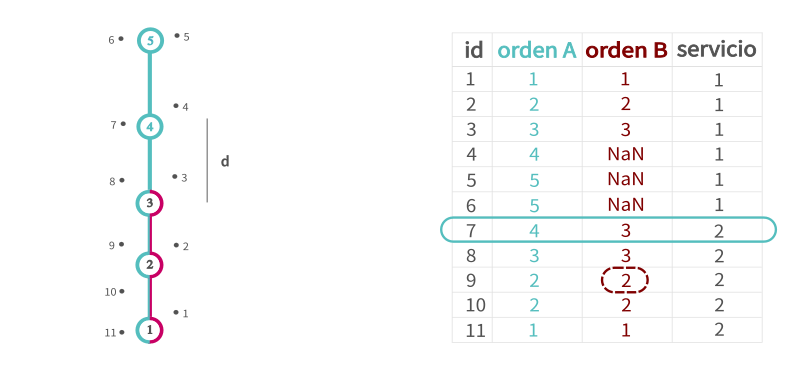
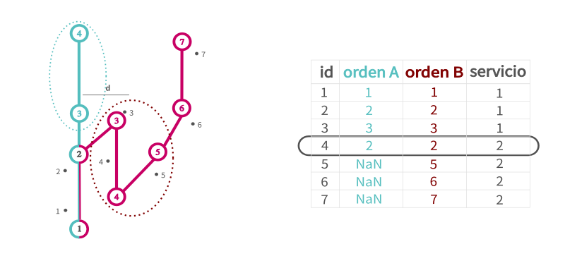
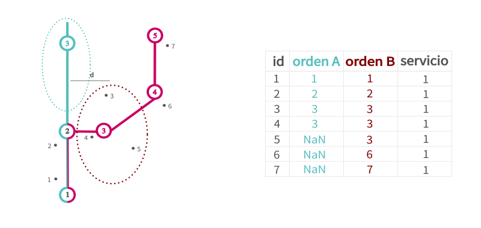
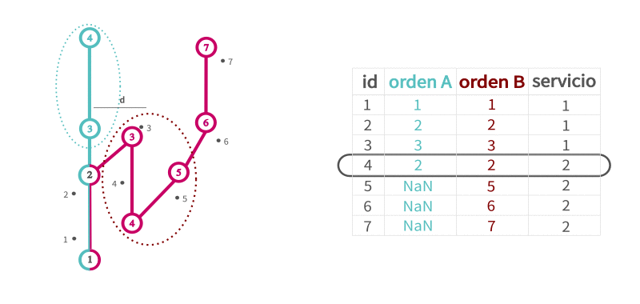

Clasificación de servicios
==========================

Normalmente en el modelo de datos de los Sistemas de Recaudación Electrónicos para transporte público existe una tabla de datos con la localización de los vehículos de las diferentes líneas en el tiempo (en UrbanTrips la tabla ``gps``). En algunos de estos modelos, existe en esa tabla un atributo que indica cuando un vehículo comienza un servicio, es decir que se presta a subir pasajeros mientras recorre el recorrido de la línea y ramal para el que presta ese servicio. En algunas ocasiones el conductor marca un inicio de servicio para todo su turno, realizando en realidad más de un servicio y posiblemente ramales diferentes en esos servicios.

Como los servicios son una unidad de información vital para obtener ciertos indicadores estadísticos del sistema, UrbanTrips procede a crear servicios en base a trazas de puntos gps cuando esta declaración de los servicios por parte del conductor no es del todo confiable. Previamente a correr los servicios es necesario que exista una tabla de gps cargada y procesada en la base de datos. Esto se puede hacer en UrbanTrips con la siguiente función, extrayendo los parámetros del archivo de configuración. 

.. code:: 

   trx.process_and_upload_gps_table(
    	nombre_archivo_gps=nombre_archivo_gps,
    	nombres_variables_gps=nombres_variables_gps,
    	formato_fecha=formato_fecha)

Dicha tabla debe tener un atributo donde se especifique el inicio de un servivcio. Tambien puede especificarse el final del mismo. Esto debera cargarse en el archivo de configuracion del especificando el [ATTR] y los valores correspondientes del siguiente modo:

.. code:: yaml

    servicios_gps: [ATTR]
    valor_inicio_servicio: [VAL]
    valor_fin_servicio: [VAL]

A su vez en el archivo de configuración se debe setear el parámetro correspondiente. Si ese atributo es confiable o si UrbanTrips debe, dentro de cada servicio tal como es declarado por el conductor, clasificar nuevos servicios.  

.. code:: yaml

   utilizar_servicios_gps: False

Por ultimo solo queda correr

.. code:: 

   services.process_services()

Como se clasifican nuevos servicios?
------------------------------------

UrbanTrips tomará los puntos gps que pertenezcan a un servicio tal cual fue declarado por el conductor (con el registro de apertura y cierre en la tabla gps) y procederá a clasificarlos en uno o más servicios, con su id nuevo, en base a un algoritmo que toma como elemento fundamental el orden de paso por las paradas.

En ese sentido, para que el proceso funcione debe estar cargada la tabla ``stops`` donde se define para cada linea y ramal una serie de paradas indicadas con el orden de paso de cada ramal. Esto se crea con la siguiente función en base a un archivo csv que debe estar creado (para la creación de paradas puede seguir el notebook ``Stops and nodes creation helper.ipynb`` que permitirá crear paradas en base a recorridos).

.. code:: 

   stops.create_stops_table()

El proceso se puede resumir del siguiente modo: cada punto gps se asignará a la parada más cercana de esa linea, con su correspondiente orden de paso. Cuando se registra una inversión en el orden de paso por parada, es decir pase de un orden ascendente a descendente o viceversa, se abrira un nuevo servicio. 

En el ejemplo del caso más sencillo, se puede ver que el punto con ``id = 10`` es donde el orden de paso de paradas se invierte, por lo tanto, es a partir de ese punto que UrbanTrips regista un nuevo servicio. 

.. image:: ../img/servicios_caso_simple.png
  :width: 800
  :alt: Clasificacion servicios linea
  

Puede suceder que una línea tenga más de un ramal. En ese caso, se evaluará el punto gps en todos los ramales de esa linea, siempre que estén dentro de una distancia razonable. Los nodos de los ramales lejanos no serán evaluados como posible orden de paso de parada. Luego se evaluará si se registra una inversión en el sentido del orden de paso por paradas. En este caso es en el ``id = 7`` en ambos ramales. 

.. image:: ../img/servicios_caso_ramal.png
  :width: 800
  :alt: Clasificacion servicios ramal

Posibles problemas y soluciones propuestas
------------------------------------------

En el ejemplo anterior, no había ambiguedad posible dado que la inversión de sentido sucede sobre un nodo que pertenece al troncal compartido por ambos ramales. Es decir, el mismo punto gps evalúa una inversión del sentido de paso por parada en ambos ramales al mismo tiempo. Pero esto no siempre puede ser así. Puede suceder que haya inversiones en diferentes momentos para los diferentes ramales.  Un caso típico es la existencia de un ramal que un fraccionado de un ramal más largo. 

En este caso se registran dos inversiones de sentido. Por un lado en ``id = 7`` al dar la vuelta sobre el ramal más extenso. Pero también se registra una inversión en ``id = 9``, dado que todos los puntos gps que iban más alla del ramal corto o fraccionado fueron evaluados como ``NaN`` o en el nodo 3 y recién percibe una inversión en el sentido del orden de paso de parada en el nodo 2. La forma que tiene UrbanTripos de resolver esto es la siguiente. Para cambiar de servicio se debe registar una inversión en todos los ramales a los cuales pertenece ese nodo. En este caso, como el nodo 5 solo pertenece al ramal A, es suficiente con que se register una sola inversión de sentido para que asigne un nuevo servicio. Pero como en el nodo 3 participan ambos ramales, a menos que esa inversión se registre en los dos, Urbantrips no abrirá un nuevo servicio. 

Otro caso particular se da cuando existe una configuración de ramales en una linea donde hay una inversión de sentido legítima que no implica un cambio de servicio. Un ramal puede ir y venir sobre sus propios pasos, teniendo paradas a lo largo de ese recorrido. Esto puede inducir un problema en este algoritmo de clasificación de servicios. Tomemos el siguiente ejemplo:

Para resolverlo, dichas paradas pueden agregarse en un único nodo mediante el campo ``node_id``. El proceso de clasificación de paradas en realidad utilizará los nodos. Con lo cual, si todas las paradas que puedan implicar una legitima inversión del sentido de paso quedan agrupadas en un único nodo, el algoritmo no registrará ese cambio. 

